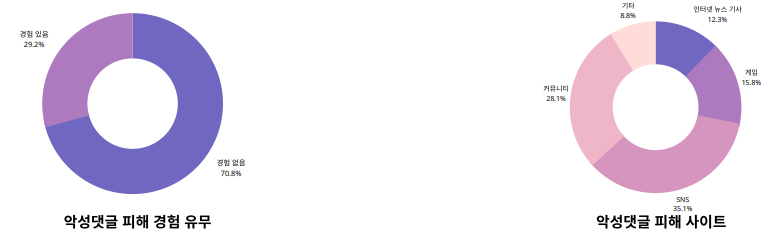
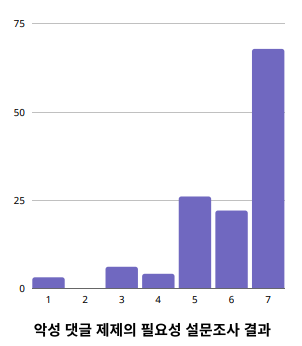
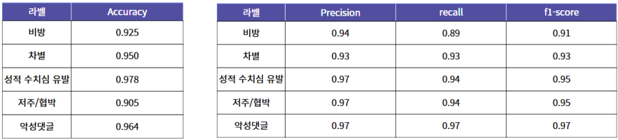
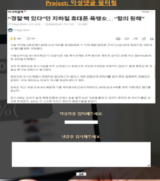
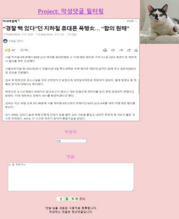
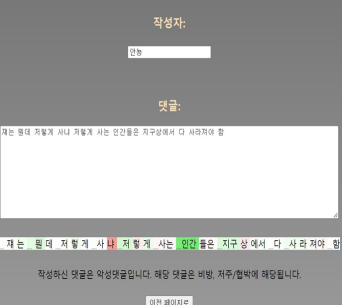
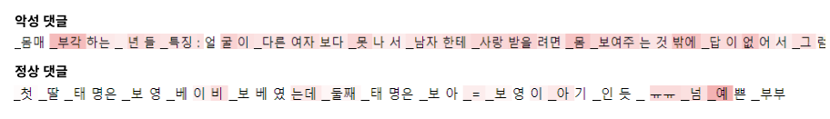

# 악성 댓글 분류 (Malicious Comment Classification)
#### 프로젝트 기간: 2022년 3월 2일 ~ 7월 7일
#### 개발 인원: 3명
#### 담당 역할 
    - 데이터 수집 및 라벨링
    - 모델링

#### 기술 스택 
    - Language: Python
    - Modeling Framework :Pytorch
    - Web Framework: Flask

## 프로젝트 상세 내용
### 문제 정의 및 주제 선정

    130명에게 악성댓글 관련 설문 조사를 진행 <br/>
    → 응답자의 약 30%가 악성 댓글 피해 경험이 있다고 응답 <br/>
    → 피해사이트는 SNS(57%), 커뮤니티(45%)가 높은 비율을 차지 <br/>

<p align="center">
    
</p>
    악성댓글 제재의 필요성 정도에 대한 설문조사 결과 응답자의 80% 이상이 5점 이상으로 악성댓글 제재가 필요하다고 답함 <br/>
    → 현존하는 악성댓글 규제방안 및 감소 대책에 불만족함을 반증

#### 기존 악성 댓글 규제 방안의 문제점
    * 사용자의 신고가 들어온 댓글을 직접 관리 <br/>
    → 모니터링에 시간과 비용이 많이 듬 <br/>

    * 욕설 등의 금지어를 이용한 필터링 <br/>
    → 변형된 비속어는 필터링이 어려움 <br/>
    → 무분별한 필터링으로 정상적인 의사표현을 방해 <br/>
    → 맥락 상의 비방/혐오 내용을 담고 있는 댓글은 필터링이 어려움 <br/>

### 프로젝트 목적
    비속어 뿐만 아니라 맥락까지 고려하여 악성 댓글을 분류해 낼 수 있는 시스템


### 데이터셋 구축
    - 데이터 출처: Korean HateSpeech Dataset, APEACH Datasets, 각 종 사이트 댓글 크롤링 후 선별
    - 비방/차별/성적 수치심 유발/저주◦협박으로 멀티 라벨링
    - 악성댓글의 세부적인 항목 분류를 통해 악성 댓글 제재 시 당위성을 부여하고자 함
    - 모델이 혼동하지 않는 명확한 악성댓글 분류 기준을 정하는 것이 어려운 부분
      → 타 연구에서 사용한 악성댓글 분류 기준을 참고하고 의논을 통해 분류 기준을 세움
      → 팀원 3명이서 교차 검증을 통해 라벨링을 진행하고 의견이 일치하지 않는 모호한 코퍼스  
          는 제외
    - 데이터 불균형 문제
    - 비방에 비해 차별/성적 수치심 유발/저주◦협박의 데이터 양은 많지 않음
    - 오버 샘플링으로 데이터 불균형 문제 완화
    
### 모델 설계
    - SKT에서 공개한 Pretrained 모델인 KoBERT를 선택
    - 세부적으로 라벨링 된 데이터가 있지만 데이터 양이 적은 편이여서 예측을 하기전에 모델이 언어의 이해도를 갖고 있다면 좋을 것이라 판단
    - 비속어가 존재하지 않더라도 문장의 맥락을 보고 악성댓글 여부를 판단하는 것이 목적
    
### 평가 지표
 <br/>

    - 설문조사를 통해 사용자들은 악성댓글을 사용하지 않았는데 악성댓글 작성자로 분류될 때 더 민감하게 반응함을 파악
    → Precision을 주요 평가 지표로 선정
    - 표현의 자유를 최대한 보장
    
### Web Demo
    - 악성댓글의 세부적인 항목 분류 결과를 작성자에게 보여줌으로서 악성 댓글 제재 시 당위성을 부여
    - Captum 라이브러리를 통해 악성댓글 세부라벨을 예측하는 데 positive한 영향을 준 토큰은 붉은색으로 시각화처리를 통해 당위성을 높이고자 하였으나 토큰 시각화가 사람이 해석하기에 직관적으로 부적절하다는 단점이 존재
    - 일정 갯수 이상의 악성댓글 작성 시 본인이 악성댓글 작성자임이 명시됨을 통해 악성댓글 작성을 자율적으로 감소시키는 방향으로 유도하고자 함


<p align="center">
    
</p>
<p align="center">
    
</p>
<p align="center">
    
</p>
<p align="center">
    
</p>

## Structure
```
Malicious-Comment-Classification-System
├─ .gitignore
├─ data
├─ dataloader
├─ KoBERT
├─ model
├─ preprocessing
├─ README.md
├─ service
└─ train
```

## How to install KoBERT 
https://github.com/SKTBrain/KoBERT

```
git clone https://github.com/SKTBrain/KoBERT.git
cd KoBERT
python setup.py install
```
